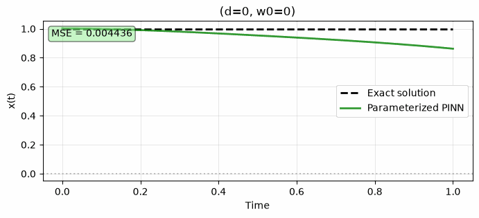

# Physics-Informed Neural Networks for Oscillators

Neural networks that learn x(t) for harmonic oscillators by putting the governing ODE into the loss function, built up from a plain data fit to a single network that solves a whole family of damped oscillators.



## Overview
- **Problem:** recover an oscillator's trajectory from very little data by penalizing violations of the equation of motion.
- **Method:** a fully connected tanh network. Derivatives dx/dt and d²x/dt² come from automatic differentiation (`torch.autograd.grad` with `create_graph=True`), and their ODE residual becomes a loss term.
- **Why tanh:** the physics loss needs second derivatives through the network. ReLU's second derivative is zero almost everywhere.

## 1. Simple harmonic oscillator (`sho/`)
- **Setup:** x'' + ω²x = 0 with ω = 30 on t ∈ [0, 1]. There are 10 training points, all in the first quarter of the domain.
- **Baseline:** data loss only (500 Adam steps). The network fits the 10 points but has no information about the rest of the domain. → `figures/nn_nosholoss.gif`
- **PINN:** data loss plus the ODE residual on 100 collocation points plus initial-condition loss (60,000 steps). → `figures/physics_nn.gif`

## 2. Damped harmonic oscillator (`damped_sho/`)
- **Equation:** x'' + 2d·x' + ω₀²x = 0, x(0) = 1, x'(0) = 0, with exact solutions for all three regimes.
- **Single-regime networks:** one network each for underdamped (d=2, ω₀=20), critically damped (d=ω₀=5) and overdamped (d=10, ω₀=5) systems. → three regime GIFs
- **Limitation shown:** a network trained on one (d, ω₀) pair fails on any other pair. It learned one function, not a solver.
- **Parameterized PINN:** input (t, d, ω₀) → x, 4×128 tanh network, trained for 60,000 steps with:
  - regime-stratified sampling of (d, ω₀), with an explicit near-critical band (d ≈ ω₀), where PINNs fail most often
  - a curriculum: underdamped first, then overdamped, then a narrowing critical band
  - residual-based adaptive resampling of collocation points every 50 steps
  - an annealed initial-condition weight and an adaptive physics weight
- **Result:** validation MSE against the exact solution of **2.5 × 10⁻⁴** at step 60,000, averaged over three held-out pairs (d, ω₀) = (1.5, 12), (3, 18), (4, 10). This comes from the saved notebook output.

## Repository layout
```
sho/            notebooks/sho_pinn.ipynb, figures/
damped_sho/     notebooks/damped_sho_pinn.ipynb, figures/
```

## Running
```bash
pip install -r requirements.txt
jupyter notebook
```
Run notebooks from their `notebooks/` folder. Training frames are written to `plots/` (git-ignored) and assembled into GIFs in `figures/`.

## Known limitations
**Known issues (being fixed)**
- In `train_pinn`, the single-regime models include a data loss against the exact solution at every collocation point, with the physics loss weighted at 1e-4, so these results are mostly supervised fits rather than physics-only PINNs. The `lambda1`, `lambda2`, and `lr` arguments are currently unused.
- The adaptive physics weight in `train_parameterized_pinn` uses `+ ratio` instead of `* ratio` in its moving average, so it does not track the loss ratio as intended.
- Overdamped parameter sampling omits the `w0_min` offset, and regime plots show t ∈ [0, 1] even when training used [0, 2].

**Evaluation**
- The reported validation MSE uses three parameter pairs, all underdamped. Accuracy in the critically damped and overdamped regimes has not been measured.
- The closed-form reference loses floating-point precision as d → ω₀, so accuracy near critical damping should be checked against a numerical ODE solver.
- Each configuration was trained with a single random seed.
- No comparison to a classical ODE solver, which is faster and more accurate for this problem. The goal here is the method, not outperforming existing solvers.

**Scope**
- Initial conditions are fixed at x(0) = 1, x'(0) = 0.
- Trained and evaluated only for t ∈ [0, 1] and d, ω₀ ∈ [0, 25].
- Noise-free synthetic data only. Inverse problems (inferring parameters from data) are not addressed.

## Acknowledgments
- The simple harmonic oscillator and single-regime damped exercises follow guidelines from Brown University's Winter AI School. The implementations are my own; TODO: note any helper functions (e.g., `plot_result`, `save_gif_PIL`) or unit tests that were provided with the exercises.
- The exercises pointed out that a PINN trained on one set of parameters cannot generalize to others. I designed and built the general solver myself: a single parameterized PINN that solves the damped oscillator across all three regimes, using regime-stratified sampling, curriculum training, residual-based resampling, and adaptive loss weighting.
- Debugging was assisted by Claude (Anthropic).
